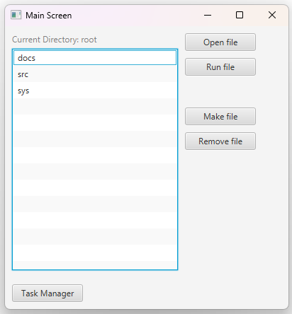

# Operativni Sistemi - Projekat
Ovaj projekat predstavlja operativni sistem razvijen sa ciljem simulacije jednoadresnog asemblerskog koda, implementacije osnovnih terminalskih komandi i GUI okruženja sa menadžerom zadataka. Sistem omogućava izvršavanje osnovnih operacija, upravljanje procesima i interakciju kroz intuitivan korisnički interfejs.

### Ključne funkcionalnosti

-   **Terminal** sa podrškom za osnovne komande
    
-   **Interpreter i kompajler jednoadresnog asemblerskog koda**
    
-   **Grafički korisnički interfejs (GUI)** sa task menadžerom
    
-   **Podrška za višezadaćnost i upravljanje procesima**
    
-   **Emulacija osnovnih operativnih funkcija**

## Terminalske komande

Sistem podržava sledeće osnovne terminalske komande:

|Komanda                |Opis                          
|----------------|-------------------------------
|CD [dir_name] | Prelazi u ciljeni direktorijum           
|DIR(S) | Ispis trenutnog / svih direktorijuma            
|PS         |Lista procesa i osnovne informacije o njima
|block [ProcessID]        |Blokiraj proces
|unblock [ProcessID]        |Napravi direktorijum
|mkdir [dir_name]        |Unblokiraj proces
|mkfile [name]        |Napravi fajl
|rd [file_name]        |Ispiši fajl
|rm [file_name]        |Uklanja datoteku
|opn [file_name]       |Otvara datoteku za mjenjanje
|run [file_name]        |Pokreće proces
|mem        |Ispis RAM memorije
|hdd         |Ispis HDD memorije
|exit         |Izlaz iz terminala

## Simulacija jednoadresnog asemblerskog koda

Sistem omogućava izvršavanje jednoadresnih asemblerskih instrukcija kao što su:

|Instrukcija| Opis | Binarna vrijednost|                          
|----------------|-------------------------------| ------|
|LDA  *[broj bloka]*| Učitaj podatak iz memorije | 0001        |
|ADD *[broj]*| Dodaj broj  |          0010|
|SUB *[broj]*|Oduzmi broj | 0011|
|STA *[broj bloka]*       |Sačuvaj podatak u memoriju|0100 |
|JMP *[broj bloka]*        | Skok na adresu | 0101|
|JNZ *[broj bloka]*    | Skok ako nije rezultat 0 |0111|
|HLT        | Zaustavi program |1111|


##### *Primjer asemblerskog koda*
```
```
  ADD 50; 	// Dodaje 50 u akumulator 
  ADD 25;	// Sabira 25 sa 50 koje je već u akumulatoru
  STA 60;	// Sprema vrijednost 75 na blok 60;
  SUB 1;	// Oduzima 1
  JNZ 3;	// Skače na komandu sa oduzimanjem 
		// sve dok ne bude 0 u akumulatoru
  HLT;		// Zaustavlja program

```
```
## Grafički korisnički interfejs (GUI)

GUI sadrži sledeće komponente:

-   **Task Manager** – prikazuje aktivne procese, omogućava njihovo zaustavljanje, pregled memorije

	

    
-   **File Manager** – omogućava pregled i manipulaciju fajlovima

    
-   **File editor** – omogućava izmjenu fajlova

